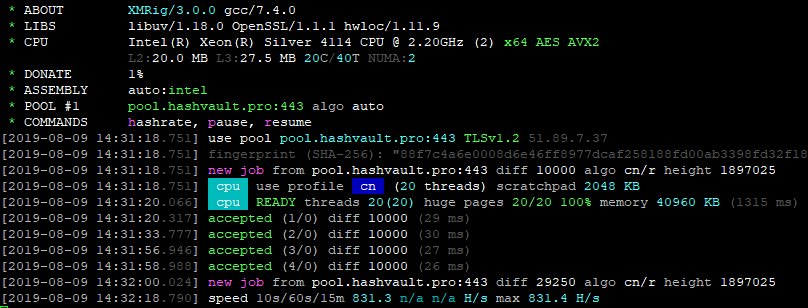
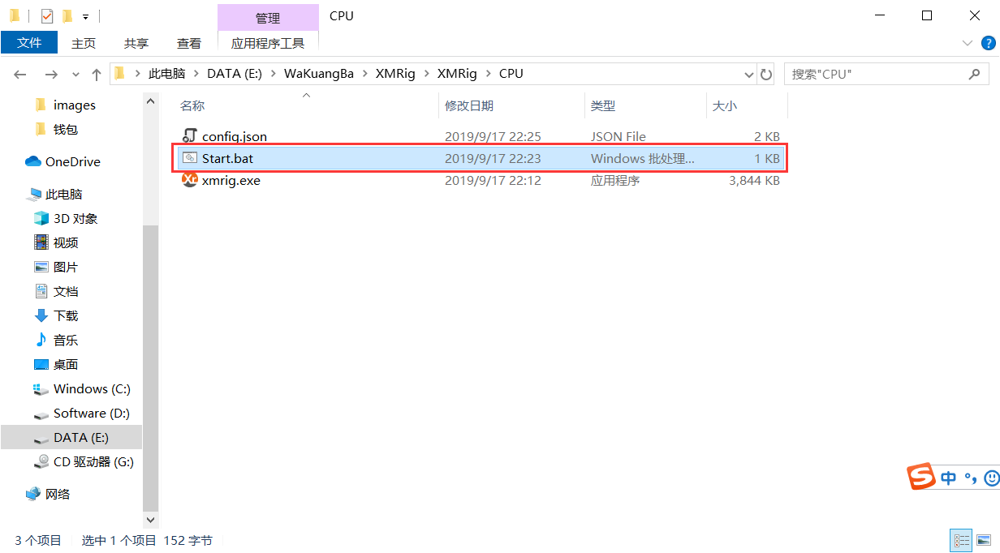
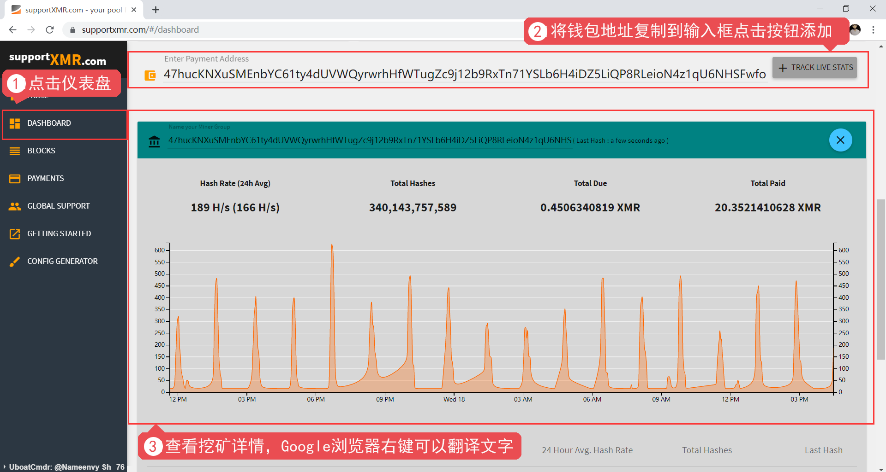

### XMRig

XMRig是一款高性能的RandomX和CryptoNight CPU挖掘工具，支持Windows。

这是CPU版本，还有NVIDIA GPU版和AMD GPU版本。



### 下载

 * Windows 版: https://github.com/xmrig/xmrig/releases

### 用法

将下载的文件后解压右键编辑Start.bat,修改矿池地址和钱地址保存双击运行Start.bat 即可。

```shell
xmrig.exe -o 矿池地址 -u 钱包地址 -p x -k
```




### 选项

```shell
  -a, --algo=ALGO               指定要使用的算法
                                  cn/r, cn/2, cn/1, cn/0, cn/double, cn/half, cn/fast,
                                  cn/rwz, cn/zls, cn/xao, cn/rto, cn/gpu,
                                  cn-lite/1,
                                  cn-heavy/xhv, cn-heavy/tube, cn-heavy/0,
                                  cn-pico,
                                  rx/wow, rx/loki
  -o, --url=URL                 指定矿池地址
  -O, --userpass=U:P            用户名:密码
  -u, --user=USERNAME           矿池用户名
  -p, --pass=PASSWORD           矿池密码
      --rig-id=ID               矿池统计的标识符（需要矿池支持）
  -t, --threads=N               矿工线程数
  -v, --av=N                    算法变化，0自动选择
  -k, --keepalive               发送keepalived数据包以防止超时（需要矿池支持）
      --nicehash                启用nicehash.com支持
      --tls                     启用SSL / TLS支持（需要矿池支持）
      --tls-fingerprint=F       池TLS证书指纹，如果设置为启用严格证书固定
      --daemon                  使用守护进程RPC代替池进行单独挖掘
      --daemon-poll-interval=N  守护程序轮询间隔（以毫秒为单位）（默认值：1000）
  -r, --retries=N               切换到备份服务器之前重试的次数（默认值：5）
  -R, --retry-pause=N           重试之间暂停的时间（默认值：5）
      --cpu-affinity            设置CPU核心的进程亲和性，核心0和1的掩码0x3
      --cpu-priority            设置进程优先级（0空闲，2正常到5最高）
      --no-huge-pages           禁用大页面支持
      --no-color                禁用彩色输出
      --donate-level=N          捐赠水平，默认5％（100分钟内5分钟）
      --user-agent              为矿池设置自定义用户代理字符串
  -B, --background              后台运行矿工
  -c, --config=FILE             加载JSON格式的配置文件
  -l, --log-file=FILE           将所有输出记录到文件中
      --asm=ASM                 ASM优化，可能的值：auto，none，intel，ryzen，bulldozer。
      --print-time=N            每N秒打印一次哈希值报告
      --api-worker-id=ID        API的自定义worker-id
      --api-id=ID               API的自定义实例ID
      --http-enabled            启用HTTP API
      --http-host=HOST          绑定HTTP API的主机（默认值：127.0.0.1）
      --http-port=N             HTTP API的绑定端口
      --http-access-token=T     HTTP API的访问令牌
      --http-no-restricted      启用对HTTP API的完全远程访问（仅限访问令牌集）
      --randomx-init=N          线程计数初始化RandomX数据集
      --randomx-no-numa         禁用对RandomX的NUMA支持
      --export-topology         将hwloc拓扑导出到XML文件并退出
      --dry-run                 测试配置并退出
  -h, --help                    显示此帮助并退出
  -V, --version                 输出版本信息并退出
```

### 查看收益

下面以 www.SupportXMR.com 矿池为例查看收益，SupportXMR 默认/最低支付0.1 XMR，可自行修改支付额度，软件中添加的矿池地址非 www.SupportXMR.com 网页端的，软件所修改的矿池例pool.supportxmr.com:5555，[更多端口点击此处](https://www.supportxmr.com/#/help/getting_started)  。

